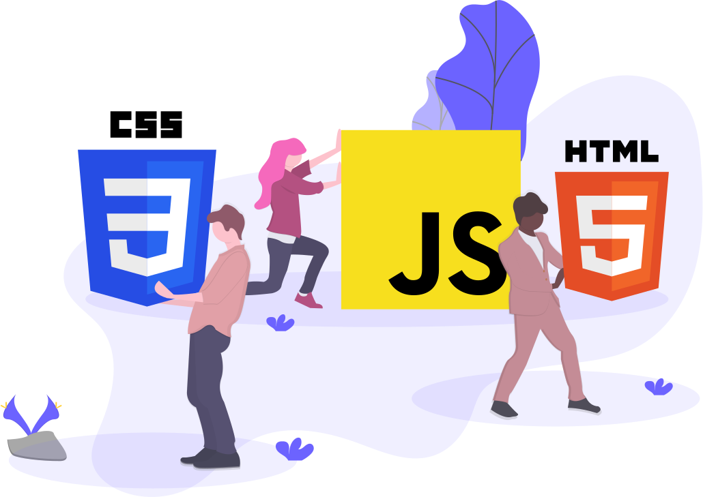

<h1 align="center">Hi 👋, I'm Achal</h1>
<h3 align="center"> Certified Google Actions Developer </h3>

- 🎓 I’m currently learning Physics , Chemistry and Maths.

- 💬 Ask me about **Web development**

- I'm currently interested in Javascript and Python.

- 🖤 I love to create chatbots for social media platform like Slack and Discord.

- I am a open-source contributor .

 
<h1 align="center"> My Github Stats</h1>

  
&nbsp;

 
 
<h1 align="center"> My Languages</h1>

